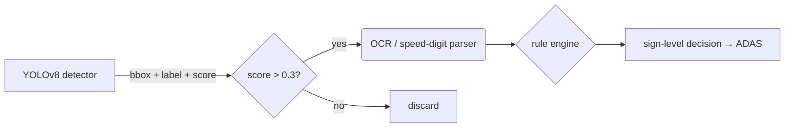

# TT‑100K Dataset: Data Processing Module README

## 1. Introduction
TT‑100K (Tsinghua–Tencent 100 K) is a large‑scale Chinese road‑traffic–sign benchmark comprising **100 000** street‑view images (2048 × 2048 px). Roughly **10 000** images contain about **30 000** annotated traffic‑sign instances, while the remaining images serve as hard negatives. Every sign is annotated with:
* **class label** (string such as `pl40`, `ip`, `w13`)
* **bounding box** `(x₁, y₁, x₂, y₂)`
* **pixel‑accurate mask** (polygon/ellipse)

Two official releases are available:

| Year | Annotation file | Classes | Images with signs | Notes |
|------|-----------------|---------|-------------------|-------|
| **2016** | `annotations.json` | 45 high‑frequency classes | 7 962 pos / 1 700 test | First CVPR‑2016 paper release |
| **2021** | `annotations2021.json` | 221 classes (232 incl. *other*) | 6 105 train / 3 071 test | Adds long‑tail categories |

The dataset is distributed under the **Creative Commons Attribution – Non‑Commercial (CC‑BY‑NC)** license.

---

## 2. Download
```bash
# 2016 release
wget -c https://cg.cs.tsinghua.edu.cn/traffic-sign/TT100K_2016.zip
# 2021 release (richer label set)
wget -c https://cg.cs.tsinghua.edu.cn/traffic-sign/TT100K_2021.zip
# Optional: negative panoramas (~90 k images, ~88 GB split into 5 parts)
```

Unzip into the following layout (recommended):

```
TT100K/
├── images/
│   ├── positive/          # 7 962 JPG (2016) or 9 176 (2021)
│   └── negative/          # 90 k JPG across 5 parts
└── annotations/
    ├── annotations.json           # 2016 45‑class subset
    └── annotations2021.json       # 221‑class full taxonomy
```

---

## 3. Label Taxonomy

Chinese traffic signs follow GB 5768‑2017.  
Each label begins with a **functional prefix** and may carry a numeric suffix:

| Prefix | Meaning | Example |
|--------|---------|---------|
| `w*`   | Warning (yellow triangle)              | `w32` – right‑turn curve |
| `p*`   | Prohibitory (white + red ring)         | `p10` – no overtaking |
| `pl*`  | *P*rohibitory **L**imit – *max speed*  | `pl40` – ≤40 km/h |
| `pm*`  | *P*rohibitory **M**in – *min speed*    | `pm20` – ≥20 km/h |
| `i*`   | Information / indication (blue square) | `ip` – pedestrian crossing |
| `ph*`  | Mandatory heading (blue circle)        | `ph4` – keep right |
| `il*`  | *I*ndication **L**imit – speed lifted  | `il60` – end 60 km/h |
| `pn`   | End of minimum‑speed                   | `pn` |
| `pr40` | Distance‑based reminder               | `pr40` – “slow‑down 40 m” |

> **45‑class official subset** (2016)  
> `i2,i4,i5,il60,il80,il100,io,ip,p3,p5,p6,p10,p11,p12,p19,p23,p26,p27,pg,ph4,ph4.5,ph5,pl20,pl30,pl40,pl50,pl60,pl70,pl80,pl100,pl120,pm20,pm30,pm55,pn,pne,po,pr40,w13,w32,w55,w57,w59,wo` (alphabetic order).  

For a **complete 221‑class list**, iterate `annotations2021.json["types"]`.

---

## 4. Annotation Format

Each image entry in JSON:

```json
{
  "id": "00001",
  "width": 2048,
  "height": 2048,
  "labels": [
    {
      "category": "pl40",
      "box": [x1, y1, x2, y2],
      "mask": [[x,y], …]      // optional polygon
    },
    …
  ]
}
```

Coordinate system: pixel indices with origin at top‑left. All boxes are axis‑aligned.

---

## 5. Preparing a Custom YOLO Dataset

1. **Parse JSON → per‑image TXT**
   ```python
   from pathlib import Path
   import json, cv2, tqdm
   ann = json.load(open('annotations/annotations.json'))
   out_root = Path('labels')
   out_root.mkdir(exist_ok=True)
   CLASSES = sorted(set(t for img in ann for t in [l['category'] for l in img['labels']]))
   cls2id = {c:i for i,c in enumerate(CLASSES)}
   for img in tqdm.tqdm(ann):
       h, w = img['height'], img['width']
       rows = []
       for lab in img['labels']:
           x1,y1,x2,y2 = lab['box']
           xc, yc = (x1+x2)/(2*w), (y1+y2)/(2*h)
           bw, bh   = (x2-x1)/w, (y2-y1)/h
           rows.append(f"{cls2id[lab['category']]} {xc:.6f} {yc:.6f} {bw:.6f} {bh:.6f}")
       (out_root / f"{img['id']}.txt").write_text('\n'.join(rows))
   ```
2. **Split**: keep official 7 962/1 700 split or random `8:1:1` train/val/test.
3. **Augment**: Mosaic + HSV jitter; synthesize extra instances for rare classes (<1 000) by perspective‑warping cropped templates onto negative backgrounds.
4. **Draft `data/tt100k.yaml`**:
   ```yaml
   path: /abs/path/TT100K
   train: images/train
   val: images/val
   test: images/test
   names: {0: i2, 1: i4, ... 44: wo}
   ```

---

## 6. Training Example (Ultralytics YOLO v8)

```bash
pip install ultralytics>=8.1
yolo detect train --model=yolov8s.pt --data=data/tt100k.yaml                   --img 640 --epochs 100 --batch 16                   --optimizer SGD --lr0 0.01 --cos-lr
```

Evaluate:

```bash
yolo detect val --data=data/tt100k.yaml                 --weights=runs/detect/train/weights/best.pt
```

The script reports **mAP@0.5**, size‑wise AP, and confusion matrix.

---

## 7. Integrating into the Recognition Pipeline



Use the 90 k negative images as a **hard‑negative filter** during validation to estimate false‑positive rate in realistic scenes. Combine detection output with OCR (to read speed limits) or lane‑level metadata as needed.

---

## 8. Testing Checklist
* **Detection AP** on 45‑class subset ≥ 0.78 mAP@0.5 (baseline 2016).  
* **FPS** ≥ 30 on NVIDIA RTX 3060 with 640‑px input.  
* **Confusion with advert boards** < 3 % (validate on negatives).  
* **End‑to‑end latency** (JPEG→JSON) ≤ 70 ms.

---

## 9. Citation

Please cite the dataset creators in academic or product documentation:

```bibtex
@InProceedings{Zhu_2016_CVPR,
  author    = {Zhu, Zhe and Liang, Dun and Zhang, Songhai and Huang, Xiaolei and Li, Baoli and Hu, Shimin},
  title     = {Traffic-Sign Detection and Classification in the Wild},
  booktitle = {Proceedings of the IEEE Conference on Computer Vision and Pattern Recognition (CVPR)},
  year      = {2016}
}
```

---

## 10. References
1. Z. Zhu *et al.* “Traffic‑Sign Detection and Classification in the Wild,” **CVPR 2016**.  
2. TT‑100K homepage, Tsinghua University.  
3. Dataset summary, Dataset Ninja.
