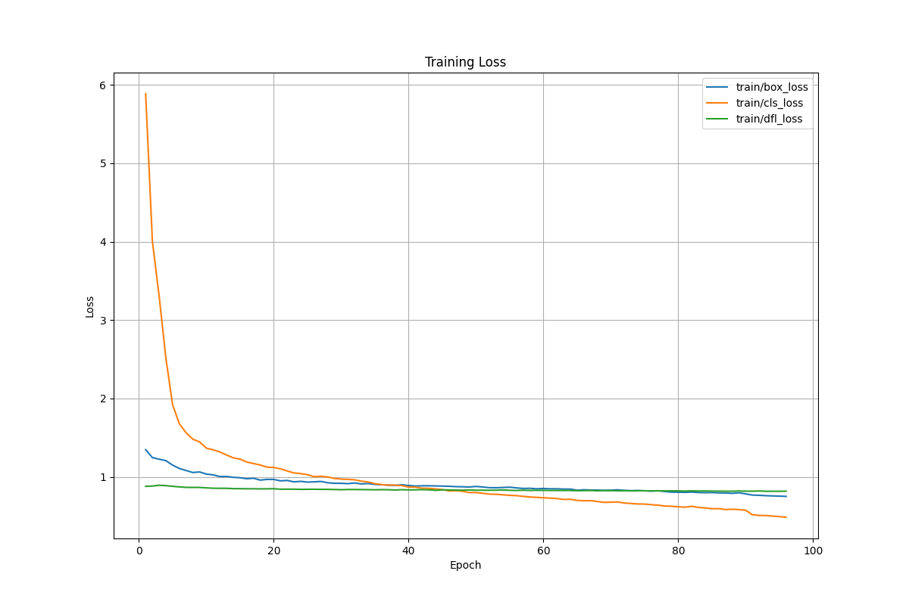
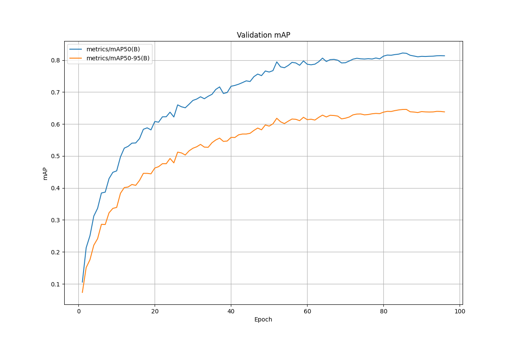
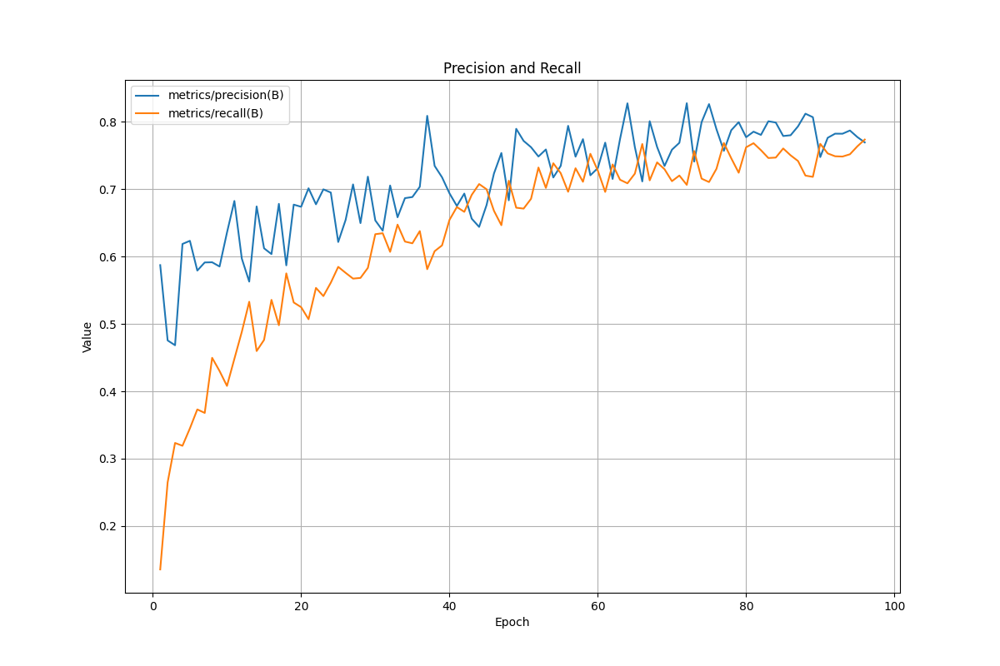

# YOLO模型训练测试报告

## 基本信息

- **报告生成时间**: 2025-05-11 00:11:56
- **训练模型**: yolo11n.pt
- **数据集**: ../outputs/dataset.yaml
- **总训练轮次**: 96
- **图像尺寸**: 896
- **批次大小**: 16

## 训练参数

```yaml
agnostic_nms: false
amp: true
augment: false
auto_augment: randaugment
batch: 16
bgr: 0.0
box: 7.5
cache: false
cfg: null
classes: null
close_mosaic: 10
cls: 0.5
conf: null
copy_paste: 0.0
copy_paste_mode: flip
cos_lr: false
cutmix: 0.0
data: ../outputs/dataset.yaml
degrees: 0.0
deterministic: true
device: '0'
dfl: 1.5
dnn: false
dropout: 0.0
dynamic: false
embed: null
epochs: 100
erasing: 0.4
exist_ok: false
fliplr: 0.5
flipud: 0.0
format: torchscript
fraction: 1.0
freeze: null
half: false
hsv_h: 0.015
hsv_s: 0.7
hsv_v: 0.4
imgsz: 896
int8: false
iou: 0.6
keras: false
kobj: 1.0
line_width: null
lr0: 0.01
lrf: 0.01
mask_ratio: 4
max_det: 300
mixup: 0.0
mode: train
model: yolo11n.pt
momentum: 0.937
mosaic: 1.0
multi_scale: false
name: t-32
nbs: 64
nms: false
opset: null
optimize: false
optimizer: auto
overlap_mask: true
patience: 100
perspective: 0.0
plots: true
pose: 12.0
pretrained: true
profile: false
project: ../outputs
rect: false
resume: false
retina_masks: false
save: true
save_conf: false
save_crop: false
save_dir: ..\outputs\t-32
save_frames: false
save_json: false
save_period: -1
save_txt: false
scale: 0.5
seed: 0
shear: 0.0
show: false
show_boxes: true
show_conf: true
show_labels: true
simplify: true
single_cls: false
source: null
split: val
stream_buffer: false
task: detect
time: null
tracker: botsort.yaml
translate: 0.1
val: true
verbose: true
vid_stride: 1
visualize: false
warmup_bias_lr: 0.1
warmup_epochs: 3.0
warmup_momentum: 0.8
weight_decay: 0.0005
workers: 8
workspace: null

```

## 训练性能

- **最终学习率**: 0.000595
- **训练时间**: 167.72 小时

## 训练损失

- **Box Loss**: 0.7519
- **Class Loss**: 0.4858
- **DFL Loss**: 0.8186

## 验证指标

### 平均精度 (mAP)

- **mAP50(B)**: 0.8136
- **mAP50-95(B)**: 0.6381

### 精确率和召回率

- **precision(B)**: 0.7692
- **recall(B)**: 0.7735

## 训练结果可视化

### Train Loss



### Val Map



### Precision Recall



